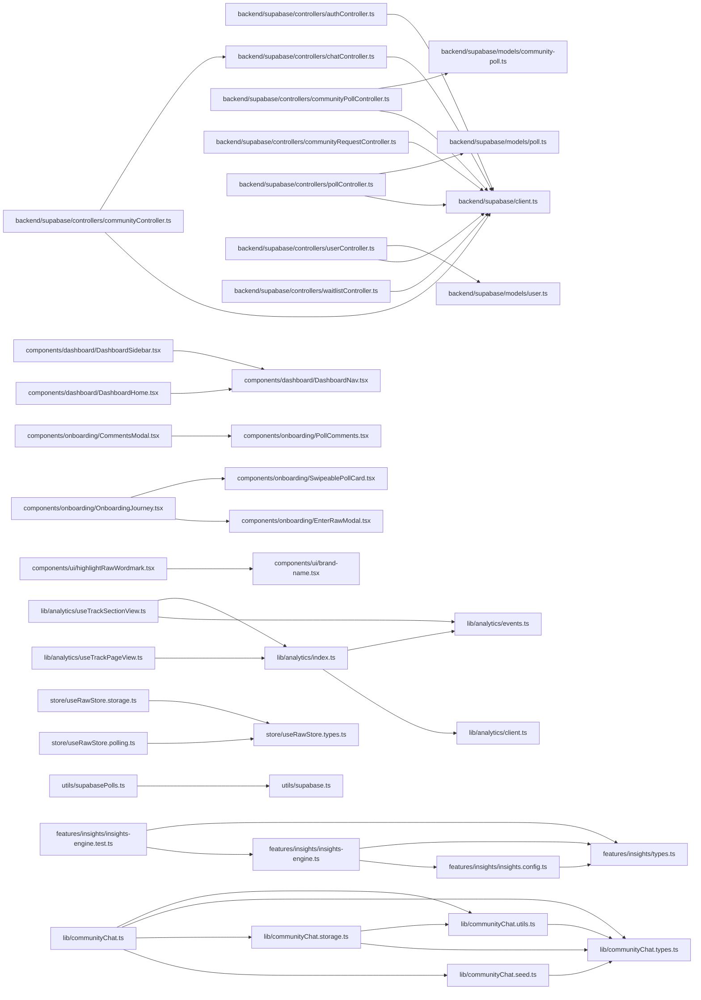

# Codebase dependency graph

Generated from `src` on 2026-05-23T08:49:57.252Z.

> Regenerate with `node scripts/graphify.mjs .`.
> Export callflow HTML with `node scripts/graphify.mjs export callflow-html .`.