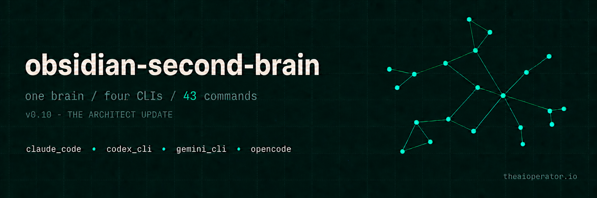

<p align="center">
  <a href="https://github.com/eugeniughelbur/obsidian-second-brain">
    
  </a>
</p>

<p align="center">
  <a href="#install"></a>
  <a href="#codex-cli--gemini-cli--opencode"></a>
  <a href="#codex-cli--gemini-cli--opencode"></a>
  <a href="#codex-cli--gemini-cli--opencode"></a>
</p>

<p align="center">
  <strong>One codebase. Four CLIs. Same brain.</strong>
</p>

<p align="center">
  
  
  
  
  <a href="https://github.com/sponsors/eugeniughelbur"></a>
</p>

<p align="center">
  <a href="https://oosmetrics.com/repo/eugeniughelbur/obsidian-second-brain"></a>
</p>

<h1 align="center">obsidian-second-brain</h1>

<p align="center">
  <strong>An evolution of <a href="https://gist.github.com/karpathy/442a6bf555914893e9891c11519de94f">Karpathy's LLM Wiki pattern</a>: a vault that rewrites itself.</strong>
  <br /><br />
  <em>Every source updates existing pages instead of just appending new ones. Contradictions reconcile automatically. Your vault compounds while you sleep.</em>
  <br /><br />
  <em>44 commands &middot; auto-synthesis &middot; thinking tools that argue with you</em>
  <br /><br />
  <em>live research from X, the web, and YouTube &middot; 4 scheduled agents &middot; 4 role presets</em>
  <br /><br />
  <em>write-time AI-first validator &middot; <code>/create-command</code> interview flow &middot; multilingual trigger schema</em>
  <br /><br />
  <a href="#what-happens-when-you-install-this">See it in action</a> &middot;
  <a href="#43-commands">All commands</a> &middot;
  <a href="#install">Install</a> &middot;
  <a href="#choose-your-preset">Presets</a> &middot;
  <a href="https://github.com/eugeniughelbur/obsidian-second-brain/discussions">Discussions</a>
</p>

<p align="center">
  <strong>v0.10 - The Architect (May 2026):</strong> new <code>/obsidian-architect</code> scans a codebase and writes maintained architecture notes into your vault - refreshable, never clobbering your edits.<br/>
  <em>Plus free key-less research, Google Calendar commands, anti-hallucination guards, and tests + CI.</em><br/>
  <a href="CHANGELOG.md">See the changelog &rarr;</a>
</p>

<p align="center">
  <strong>From the blog</strong> &middot; <a href="https://theaioperator.io">The AI Operator &rarr;</a>
</p>

<p align="center">
  <strong>Latest:</strong> <a href="https://theaioperator.io/p/huge-update-on-obsidian-second-brain">"HUGE update on obsidian-second-brain: The Architect"</a><br />
  <em>v0.10 ships <code>/obsidian-architect</code> &middot; document your codebase into your vault &middot; the full before-and-after</em>
</p>

<p align="center">
  <strong>Deep dive:</strong> <a href="https://theaioperator.io/p/i-rebuilt-karpathys-llm-wiki-heres">"I rebuilt Karpathy's LLM Wiki. Here's what's missing from the original."</a><br />
  <em>Why append-only breaks at scale &middot; the AI-First Vault Principle &middot; three bugs in v1</em>
</p>

<p align="center">
  <strong>Origin story:</strong> <a href="https://theaioperator.io/p/i-built-this-for-myself-then-1374">"I built this for myself. Then 1,374 strangers cloned it."</a><br />
  <em>Two disconnected tools &middot; the institutional-amnesia problem &middot; 1,000+ stars in 7 weeks</em>
</p>

<p align="center">
  <em>One post per Tuesday on Obsidian + AI workflows and bringing AI into real work.</em>
</p>

<p align="center">
  <strong>Research toolkit &middot; dual-track</strong><br/>
  <code>/x-read</code> &middot; <code>/x-pulse</code> &middot; <code>/research</code> &middot; <code>/research-deep</code> &middot; <code>/notebooklm</code> &middot; <code>/youtube</code> &middot; <code>/podcast</code>
</p>

<p align="center">
  <em><strong>Open-web track</strong> &middot; <code>/research-deep</code> via Perplexity + Grok. Pulls fresh signal from outside.<br/>
  <strong>Source-grounded track</strong> &middot; <code>/notebooklm</code> via Gemini File Search. Reads your own vault.<br/>
  Run both for high-stakes topics. <strong>Contradictions across the two are where the insight is.</strong></em>
</p>

<p align="center">
  Built by <a href="https://github.com/eugeniughelbur"><strong>Eugeniu Ghelbur</strong></a> &middot; AI Automation Engineer @ Single Grain<br />
  <em>building in public &middot; sharing what works</em>
</p>

<div align="center">

<table>
<tr>
<td align="center" width="700">

### Follow along

*Weekly posts on AI second-brain systems, vault patterns, and what actually works.*

<a href="https://x.com/eugeniu_ghelbur"></a>
<a href="https://www.linkedin.com/in/eugeniu-ghelbur/"></a>
<a href="https://theaioperator.io"></a>
<a href="https://github.com/eugeniughelbur"></a>

</td>
</tr>
</table>

</div>

---

## The Problem

You use Claude every day. Every session starts from scratch. You re-explain everything. The conversation ends. Everything disappears.

You take notes in Obsidian. Hundreds of files. They just sit there. You make the same decision twice because you forgot you made it six months ago. Ideas rot in daily notes. Nobody connects the dots.

**Two powerful tools. Completely disconnected.**

---

## How this extends Karpathy's LLM Wiki

Karpathy's pattern is brilliant. Drop sources, LLM creates wiki pages, ask questions. This skill takes it further:

| | Karpathy's LLM Wiki | obsidian-second-brain |
|---|---|---|
| **New sources** | Append new pages, cross-reference | **Rewrite existing pages.** People get updated, claims revised, stale facts replaced. |
| **Contradictions** | Flagged, you resolve manually | `/obsidian-reconcile` resolves them automatically |
| **Patterns** | Surface when you ask | `/obsidian-synthesize` finds unnamed patterns and writes synthesis pages on its own |
| **When it runs** | On demand, when you prompt | 4 scheduled agents: nightly close, weekly review, contradiction sweep, vault-health check |
| **Note format** | Human-readable wiki pages | AI-first: `## For future Claude` preamble + frontmatter for LLM retrieval, not human review |

If Karpathy's wiki is a knowledge base you maintain with an LLM, this is a knowledge base that maintains itself.

---

## What Happens When You Install This

**After a meeting:** `/obsidian-save`
Claude pulls out every decision, person, task, and idea and saves each one to the right note. You do nothing.

**You recorded a voice memo:** `/obsidian-ingest meeting.m4a`
Claude transcribes it with Whisper, identifies speakers, extracts every promise and action item, and distributes across entity pages, task boards, and the daily note.

**You screenshot a whiteboard:** `/obsidian-ingest photo.png`
Claude reads the image, extracts text and structure, creates concept notes, links to related projects. A photo becomes knowledge.

**You find a great video:** `/obsidian-ingest https://youtube.com/...`
Claude doesn't summarize into one note. It REWRITES your existing pages. People get updated. Contradictions get resolved. Patterns trigger new synthesis pages. One URL in. The vault is smarter.

**Before a big decision:** `/obsidian-challenge`
Claude searches your vault for past failures and reversed decisions on the same topic. Pushes back with your own words. Your vault holds you accountable.

**You want to see the big picture:** `/obsidian-visualize`
Claude generates a visual canvas of your entire vault. Hub nodes centered, color-coded by type, orphans highlighted. Open it in Obsidian and see the shape of your knowledge.

**You go to sleep:** The nightly agent runs 5 phases: closes the day, reconciles contradictions, synthesizes cross-source patterns, heals orphan notes, and rebuilds the index. You wake up to a smarter vault.

**You start a new day:** `/obsidian-daily`
Claude pulls your calendar events, overdue tasks, and overnight changes into today's note. Your morning starts informed.

**Someone shares an X post:** `/x-read https://x.com/...`
Grok with live X access fetches the post, the thread, and the replies. Returns verbatim text + TL;DR + key claims + reply sentiment + voices to watch. No more screenshots.

**You're planning today's content:** `/x-pulse "AI automation"`
Grok scans X for what's trending in your topic right now. Returns 3-5 emerging themes (with rep posts + key voices), gaps nobody is filling, hook formats that are working, and 3 specific post ideas you could write today.

**You need real research:** `/research "AI memory tools"`
Perplexity Sonar Pro pulls a deep dossier with citations: summary, key facts (every claim with a recency marker and source domain), timeline, key players, contrarian views, recommended further reading, open questions. Saved to your vault, auto-opens in Obsidian.

**You want vault-first deep research:** `/research-deep "AI memory tools"`
Scans your vault for what you already know. Identifies gaps. Spawns 3-5 targeted searches via Perplexity (web) and Grok (X discourse). Synthesizes a delta report: what's new, what's confirmed, contradictions to resolve, recommended vault updates. Vault baseline doesn't get re-researched. Only gaps get filled.

**You hit a great YouTube video:** `/youtube https://youtu.be/...`
Free transcript via youtube-transcript-api. Optional metadata + top comments via YouTube Data API v3. Grok summarizes into TL;DR, Key Points, Notable Quotes (verbatim), Themes, Comment Sentiment, and Worth Following Up On. Saved as an AI-first note in your vault.

**You never open Obsidian.** Everything happens through Claude.

---

## Before & After

| | Without this skill | With this skill |
|---|---|---|
| Saving decisions | Copy-paste or lose them | Auto-saved to the right project note |
| Daily notes | Write it yourself, forget half the time | Created automatically |
| Finding patterns | Re-read dozens of notes | `/emerge` finds them for you |
| Challenging yourself | Nobody pushes back | `/challenge` uses your own history against you |
| Session continuity | Re-explain every time | `/world` loads full context in 10 seconds |
| Ingesting content | Read it, forget it | `/ingest` rewrites 5-15 vault pages from 1 source (URLs, PDFs, audio, screenshots) |
| Contradictions | You don't know they exist | `/reconcile` resolves them automatically |
| Synthesis | You connect dots manually | `/synthesize` finds patterns across sources on its own |
| Sharing vault data | Only Claude can read it | `/export` gives any AI tool a clean snapshot |
| Facts change over time | Old info gets overwritten | Bi-temporal facts track when it was true AND when the vault learned it |
| Starting a new session | Re-explain who you are | `CRITICAL_FACTS.md` loads your identity in ~120 tokens |
| Reading an X thread | Open X, scroll, screenshot, paste | `/x-read [url]` returns post + thread + sentiment + voices |
| Knowing what to post | Guess what's trending | `/x-pulse` scans X and returns hot themes + gaps + hooks + post ideas |
| Web research | Open 12 tabs, copy quotes manually | `/research [topic]` returns a sourced dossier with recency markers |
| Researching what you already know | Re-research from scratch | `/research-deep` scans vault first, fills only the gaps, flags contradictions |
| YouTube videos | Watch passively, forget | `/youtube [url]` transcript + summary + quotes saved to vault |
| Vault notes for future-Claude | Notes for human reading | AI-first rule: every note has "For future Claude" preamble + recency markers + citations |

---

## How It Works

```
  +------------------------------------------+
  |                                          |
  |   LAYER 1: Operations (28 commands)      |
  |   Claude remembers everything            |
  |                                          |
  +------------------------------------------+
  |                                          |
  |   LAYER 2: Thinking Tools (7 commands)   |
  |   Claude thinks with you                 |
  |                                          |
  +------------------------------------------+
  |                                          |
  |   LAYER 3: Context Engine (1 command)    |
  |   Claude knows who you are               |
  |                                          |
  +------------------------------------------+
  |                                          |
  |   LAYER 4: Research Toolkit (7 commands) |
  |   Claude pulls knowledge in              |
  |                                          |
  +------------------------------------------+
  |                                          |
  |   ALWAYS ON                              |
  |   Background agent + 4 scheduled agents  |
  |   Auto-synthesis + save reminders        |
  |                                          |
  +------------------------------------------+
```

44 commands total. The 4 Google Calendar commands (in Operations) are Claude Code only, so the Codex / Gemini / OpenCode builds ship 40.

**Layer 1** saves, organizes, ingests, reconciles, exports, schedules your calendar, and maintains your vault.
**Layer 2** challenges your ideas, surfaces hidden patterns, bridges unrelated domains, and graduates ideas into projects.
**Layer 3** loads your identity and current state so every session picks up where the last one ended.
**Layer 4** pulls live external knowledge into the vault: X posts, X trends, web research with citations (key-less by default), YouTube and podcast transcripts. Vault-first synthesis knows what you already know.
**Always On** keeps the vault alive without you lifting a finger.

---

## 44 Commands

### Operations -- Claude remembers

| Command | What it does |
|---|---|
| `/obsidian-save` | Saves everything from the conversation -- decisions, tasks, people, ideas |
| `/obsidian-ingest` | Drop a URL, PDF, audio file, or screenshot. The vault REWRITES itself. 5-15 pages touched per source. |
| `/obsidian-synthesize` | Auto-finds patterns across sources and writes synthesis pages |
| `/obsidian-reconcile` | Finds contradictions and resolves them. The vault maintains its own truth. |
| `/obsidian-export` | Clean JSON/markdown snapshot any AI tool can read |
| `/obsidian-daily` | Creates or updates today's daily note |
| `/obsidian-agenda` | Reads Google Calendar and writes an AI-first snapshot (conflicts, focus blocks, attendee links) |
| `/obsidian-schedule` | Creates or moves a Google Calendar event from a task or standalone, links it back to the task |
| `/obsidian-meeting` | Generates a meeting note from a calendar event (attendees, time, link pre-filled) |
| `/obsidian-calendar` | Reconciles the vault against your calendar - flags commitments not yet scheduled (flag only) |
| `/obsidian-recurring` | Tracks a recurring obligation with a cadence and a computed next-due date |
| `/obsidian-log` | Logs a work session, links it everywhere |
| `/obsidian-task` | Adds task to the right board with priority and due date |
| `/obsidian-person` | Creates or updates a person note |
| `/obsidian-decide` | Logs decisions to the right project note |
| `/obsidian-capture` | Zero-friction idea capture |
| `/obsidian-find` | Smart search with context |
| `/obsidian-recap` | Summary of a day, week, or month |
| `/obsidian-review` | Structured weekly or monthly review |
| `/obsidian-board` | Kanban board view and updates |
| `/obsidian-project` | Project note with board and daily links |
| `/obsidian-projects` | Live project status from git + local docs -- infers all context from vault notes, no config required |
| `/obsidian-health` | Vault audit -- contradictions, gaps, stale claims, orphans |
| `/obsidian-adr` | Decision records -- the vault knows why it's structured this way |
| `/obsidian-visualize` | Generates a visual canvas map of your second brain |
| `/obsidian-learn` | Reviews vault learnings, prunes stale ones, surfaces patterns to promote into rules |
| `/obsidian-init` | Generates `_CLAUDE.md`, `index.md`, `log.md` |
| `/obsidian-architect` | Scans a codebase and writes maintained architecture notes (overview, modules, decisions) into the vault; re-run to refresh |
| `/create-command` | Interview flow that scaffolds a new command into `commands/<name>.md`, no markdown editing |

### Thinking -- Claude thinks with you

| Command | What it does |
|---|---|
| `/obsidian-challenge` | Your vault argues against your idea using your own history |
| `/obsidian-panel` | Convenes a panel of distinct perspectives on a decision, one verdict each + synthesis |
| `/obsidian-emerge` | Surfaces patterns from 30 days of notes you never named |
| `/obsidian-connect [A] [B]` | Bridges two unrelated domains to spark new ideas |
| `/vault-deep-synthesis [topic]` | Cross-references every note on a topic: agreements, contradictions, stale claims, gaps |
| `/idea-discovery` | Ranks 3-5 next-direction candidates from ideas, open questions, and orphan research |
| `/obsidian-graduate` | Turns an idea fragment into a full project with tasks |

### Context -- Claude knows you

| Command | What it does |
|---|---|
| `/obsidian-world` | Loads identity + state with progressive token budgets (L0-L3) |

### Research -- Claude pulls knowledge in

Powered by xAI Grok (live X access) + Perplexity Sonar (web research) + YouTube. Findings save to `Research/` as AI-first notes (preamble, frontmatter, recency markers, sources verbatim).

| Command | What it does |
|---|---|
| `/x-read [url]` | Deep-read an X post: verbatim post + thread + TL;DR + claims + reply sentiment + voices |
| `/x-pulse [topic]` | Scan X for what's trending: themes, voices, hooks, post ideas |
| `/research [topic]` | Web research with citations: full dossier with recency markers and open questions. Uses Perplexity when keyed, free key-less sources (Wikipedia, HackerNews, arXiv, Reddit, and more) otherwise |
| `/research-deep [topic]` | Vault-first synthesis (open web): scans your vault, finds gaps, fills them via Perplexity + Grok (or free key-less sources when unkeyed), propagates updates across people/projects/ideas |
| `/notebooklm [topic]` | Vault-grounded synthesis via Gemini File Search. Uploads top 12 vault notes, returns a grounded answer with citations. No browser, one HTTP call. Pairs with `/research-deep` for dual-track research. |
| `/youtube [url]` | Extract transcript + metadata + top comments → AI-first summary |
| `/podcast [url]` | Apple Podcasts or RSS → transcript (RSS tag / Whisper / show-notes) + AI-first summary |

**Setup:** copy `.env.example` to `~/.config/obsidian-second-brain/.env`, add your keys (xAI, Perplexity, YouTube optional, OpenAI optional for podcast Whisper). Run `install.sh` and answer "y" to the research prompt to do this automatically.

**No keys? `/research` and `/research-deep` still work.** With no `PERPLEXITY_API_KEY` set they automatically fall back to free, key-less sources (Wikipedia, HackerNews, arXiv, Reddit, Lobsters, dev.to, OpenAlex, Semantic Scholar, CrossRef, DuckDuckGo) and Claude synthesizes the dossier. Pass `--free` to force it even when keyed, or `--academic` to restrict to scholarly sources. The other research commands (`/x-read`, `/x-pulse`, `/notebooklm`, `/youtube`) still need their respective keys.

<details>
<summary><strong>See the thinking tools in action</strong></summary>

<br />

**`/obsidian-challenge`**

You: *"I want to rewrite the API in Rust."*

Claude finds your 2025 post-mortem where the Rust rewrite failed. Finds your decision log committing to TypeScript for 2 years. Says: *"Your own notes say this failed. Still want to proceed?"*

---

**`/obsidian-emerge`**

Claude scans 30 daily notes. You mentioned "onboarding friction" in 4 unrelated projects.

*"Onboarding is your bottleneck across projects. You never named it."*

---

**`/obsidian-connect "distributed systems" "cooking"`**

Traces both clusters in your link graph. Finds shared concepts: preparation and load distribution. Generates 3 actionable ideas at the intersection.

---

**`/obsidian-graduate`**

An idea from 3 weeks ago. Claude reads it, finds related projects and people, generates a full spec with goals, phases, tasks, and board entries. The idea gets tagged `graduated`.

</details>

<details>
<summary><strong>See /obsidian-ingest in action</strong></summary>

<br />

```
/obsidian-ingest https://youtube.com/watch?v=example
```

1. Saves original to `raw/videos/` (immutable)
2. REWRITES entity pages with new context
3. REWRITES concept pages if the source adds depth or contradicts them
4. Creates synthesis pages when patterns emerge
5. Resolves contradictions and documents why
6. Updates `index.md`, `log.md`, daily note

**One URL in. The vault rewrites itself.**

</details>

<details>
<summary><strong>See the research toolkit in action</strong></summary>

<br />

**`/x-read https://x.com/garrytan/status/2048121438914154664`**

Grok with live X access fetches the post and replies. You get verbatim text, TL;DR, key claims, reply sentiment (~70% positive, 20% skeptical, 10% off-topic), notable counter-arguments with the @ handles of who said them, and "voices to watch" (the replies that added real signal). ~$0.05/call.

---

**`/x-pulse "AI automation"`**

```
WHAT'S HOT (last 24-72h)
  1. Agentic AI vs Basic Automation — voices: @NVIDIAAP, @woisau1
  2. Self-Improving Sovereign Agents — voices: @tom_doerr, @AIDailyGems
  3. Control Layers & Execution Gaps — voices: @ZIQING_JP

WHAT'S UNDEREXPLORED
  - ROI numbers for non-developer small business users
  - Integration of digital agents with physical robotics

HOOKS THAT ARE WORKING
  - "Automation executes. Autonomy reasons." — @NVIDIAAP

POST IDEAS FOR YOU TODAY
  1. Thread: "I gave an open-source agent its own GitHub repo and watched it self-improve"
  2. Single: "Automation executes. Autonomy reasons. Here's the control layer..."
```

What you'd spend 2 hours scrolling X to find. Returned in 30 seconds for ~$0.13.

---

**`/research "AI memory tools"`**

Returns a structured dossier: Summary, Key Facts (each with `(as of YYYY-MM, source.com)`), Timeline, Key Players, Contrarian Views, Recommended Further Reading, Open Questions, full citations. Saved to `Research/Web/` as an AI-first note. ~$0.05/call.

---

**`/research-deep "AI memory tools"`**

```
Phase 1: Vault scan
  Found 8 relevant notes (e.g. Knowledge/2026-02-15 - Mem0 vs Letta.md)

Phase 2: Gap analysis (Perplexity sonar-pro)
  Identified 5 targeted queries to fill what vault is silent or stale on

Phase 3: Targeted research
  [web] Anthropic Claude memory tool 2026 features
  [web] Mem0 Series A reactions and concerns
  [x]   developer reactions to Letta vs Mem0
  ...

Phase 4: Synthesis (sonar-reasoning-pro)
  → What's New Since Vault Baseline
  → What's Confirmed
  → Contradictions / Updates Needed (with [[wikilinks]] to specific vault files)
  → Synthesis bullets
  → Recommended Vault Updates (instructions for /obsidian-save)
  → Open Questions
```

Vault-first means it doesn't waste tokens re-researching what you already knew. ~$0.40/call.

---

**`/notebooklm "AI-first vault rule"`** - vault-grounded, no browser

Scans the vault, uploads the top 12 most relevant notes to a Gemini File Search store, asks Gemini 2.5 Flash to synthesize against THOSE sources only with citations, writes the synthesis to `Research/NotebookLM/` as an AI-first note, deletes the store.

```
Vault baseline: 12 notes
Model: gemini-2.5-flash
Uploading 12 notes... done
Asking Gemini, grounded against the uploaded sources...

=== SAVED ===
Research/NotebookLM/2026-05-15 - ai-first-vault-rule.md
```

Pair with `/research-deep` on the same topic. Open-web view + vault-grounded view rarely contradict. Where they do, that's where you have a take worth posting. ~$0.004/call on free-tier Flash, ~$0.06 on paid Pro.

---

**`/youtube https://youtu.be/...`**

Free transcript via youtube-transcript-api + optional metadata + comments via YouTube Data API v3 (free tier). Grok summarizes into TL;DR, Key Points, Notable Quotes (verbatim), Themes, Comment Sentiment, and Worth Following Up On. ~$0.04 for the Grok call. Frontmatter includes view count, channel, published date, like count for Dataview queries.

---

**`/podcast https://podcasts.apple.com/...`** (or paste an RSS feed URL)

Resolves Apple Podcasts URLs to RSS via the free iTunes Lookup API. Picks the best transcript source available: `<podcast:transcript>` tag in the RSS feed (free, high fidelity) → Whisper API if `OPENAI_API_KEY` is set (~$0.006/min) → show-notes fallback. Grok summarizes into TL;DR, Key Points, Notable Quotes, Themes, Guests & People Mentioned, and Worth Following Up On. ~$0.04 for the Grok call (plus Whisper if used). Spotify URLs aren't supported (DRM).

---

**Auto-open after every save.** Obsidian pops open at the new note. Disable with `RESEARCH_AUTOOPEN=0` if you're running batch saves.

</details>

---

## The Vault is Alive

Traditional vaults are filing cabinets. You put things in. They sit there.

This vault rewrites itself with every input:

- **Ingest a source** -- existing pages get rewritten, contradictions resolved, patterns synthesized
- **Save a conversation** -- entities, concepts, and decisions distribute across the vault
- **Ask a question** -- the Two-Output Rule means every answer also updates pages
- **A fact changes** -- bi-temporal facts track when it was true AND when the vault learned it. "You believed X on Tuesday. After ingesting Y on Wednesday, you shifted to Z." Full audit trail.
- **Do nothing** -- background agent and scheduled agents maintain it while you sleep
- **Wait a week** -- auto-synthesis finds cross-source patterns and writes connection pages

The vault after a week is fundamentally different from the vault you started with.

---

## Choose Your Preset

Pick your role at bootstrap. Each preset creates tailored folder structures, templates, and kanban boards.

| Preset | Who it's for | Kanban style |
|---|---|---|
| **executive** | Founders, operators, managers | OKRs / Quarterly / Weekly |
| **builder** | Developers, engineers, architects | Backlog / Sprint / Done |
| **creator** | Writers, YouTubers, marketers | Ideas / Drafts / Published |
| **researcher** | Academics, analysts, deep-divers | Reading / Processing / Synthesized |

```bash
python bootstrap_vault.py --path ~/my-vault --name "Your Name" --preset builder
```

No preset? You get a general-purpose vault that works for everyone.

---

## Background Agent & Scheduled Agents

**Background:** fires after every context compaction. You keep working. The vault updates itself.

```
PostCompact -> obsidian-bg-agent.sh -> claude -p (headless) -> vault updated
```

**Scheduled:**

| Agent | When | What |
|---|---|---|
| `morning` | 8 AM | Daily note + overdue tasks |
| `nightly` | 10 PM | Sleeptime consolidation: close day + reconcile + synthesize + heal orphans |
| `weekly` | Fridays 6 PM | Weekly review |
| `health` | Sundays 9 PM | Vault health audit |

**Save reminders:** Claude nudges you to `/obsidian-save` after 10+ exchanges or when you say "done" or "thanks". No lost conversations.

---

## Vault Architecture

### Wiki-style (default) -- LLM-first

Claude is the reader and writer. The vault is a database.

```
vault/
+-- _CLAUDE.md          # Operating manual
+-- index.md            # Page catalog (Claude reads FIRST)
+-- log.md              # Activity timeline
+-- SOUL.md             # Your identity
+-- CRITICAL_FACTS.md   # ~120 tokens, always loaded (timezone, manager, location)
+-- raw/                # IMMUTABLE source material
+-- wiki/               # Claude's workspace
|   +-- entities/       # People, companies, tools
|   +-- concepts/       # Ideas, frameworks, synthesis
|   +-- projects/       # Project notes
|   +-- daily/          # Daily notes
|   +-- logs/           # Work session logs
|   +-- reviews/        # Weekly/monthly reviews
|   +-- tasks/          # Task notes
|   +-- decisions/      # ADRs
+-- boards/             # Kanban boards
+-- templates/          # Note templates
```

---

## Install

> **One codebase, four platforms.** Pick yours below. The vault behavior is identical across all four; only the install path and the dispatcher file (`CLAUDE.md` / `AGENTS.md` / `GEMINI.md`) differ.

### Claude Code (default)

One line:

```bash
curl -fsSL https://raw.githubusercontent.com/eugeniughelbur/obsidian-second-brain/main/scripts/quick-install.sh | bash
```

Or two commands:

```bash
git clone https://github.com/eugeniughelbur/obsidian-second-brain ~/.claude/skills/obsidian-second-brain
bash ~/.claude/skills/obsidian-second-brain/scripts/setup.sh "/path/to/your/vault"
```

Then: `/obsidian-init`

### Codex CLI / Gemini CLI / OpenCode

```bash
git clone https://github.com/eugeniughelbur/obsidian-second-brain
cd obsidian-second-brain
bash scripts/build.sh --platform codex-cli   # or gemini-cli, or opencode
cp -R dist/codex-cli/. /path/to/your/vault/   # or .gemini-cli / .opencode/
```

Then start your CLI from the vault root. Each build produces a platform-specific dispatcher (`AGENTS.md` for Codex / OpenCode, `GEMINI.md` for Gemini) with an **auto-generated routing table** mapping natural-language triggers to command files under `.codex/commands/` (or `.gemini/`, `.opencode/`).

Codex has no native slash-command runtime, so to run a command by name there, install the wrappers: `bash scripts/install-codex-wrappers.sh` creates one shim per command in `~/.codex/bin/` (each delegating to `scripts/run-command.sh`, which wraps the command into a `codex exec` prompt). Use `scripts/run-command.sh --print <command>` to preview the assembled prompt without running it.

Run `bash scripts/build.sh` with no arguments to build all four platforms at once. See [`dist/<platform>/INSTALL.md`](scripts/build.sh) after building for platform-specific notes.

### Run on Hermes / open models

The skill is model-agnostic. The OpenCode build (and the Codex / Gemini builds) are plain instruction files, so they run on whatever model the host CLI is pointed at - including open models like [Nous Research Hermes](https://github.com/NousResearch/hermes-agent). No separate build, no code changes. You set the model on OpenCode's side.

Point OpenCode at Hermes via OpenRouter. Authenticate once (`/connect`, search OpenRouter, paste your key - or `export OPENROUTER_API_KEY=...`), then in `opencode.json`:

```json
{
  "$schema": "https://opencode.ai/config.json",
  "model": "openrouter/nousresearch/hermes-4-70b",
  "provider": {
    "openrouter": {
      "models": {
        "nousresearch/hermes-4-70b": {}
      }
    }
  }
}
```

Hermes models on OpenRouter (as of 2026-06, [openrouter.ai](https://openrouter.ai/models?q=hermes)):

| Model id | Best for | Cost (in / out per 1M tokens) |
|---|---|---|
| `nousresearch/hermes-4-70b` | Default. Cheap, capable, 131k context. | $0.13 / $0.40 |
| `nousresearch/hermes-4-405b` | Strongest instruction-following for the synthesis-heavy commands. | $1.00 / $3.00 |
| `nousresearch/hermes-3-llama-3.1-405b:free` | Zero-cost trial (needs any OpenRouter key to authenticate). | free |

For the privacy story, run a smaller Hermes locally through [Ollama](https://ollama.com) or LM Studio and point OpenCode at the local endpoint - no data leaves your machine.

What to expect (open models follow instructions less reliably than Claude, so this is honest, not a promise of parity): the core commands - `/obsidian-save`, `/obsidian-daily`, `/obsidian-capture`, `/obsidian-find`, `/obsidian-task`, and `/research` in free mode - hold up well. The sub-agent-heavy commands and the deep synthesis ones (`/obsidian-architect`, `/obsidian-reconcile`, `/research-deep`) lean hard on instruction-following, so prefer `hermes-4-405b` (or Claude) for those. The AI-first vault rule still applies on every write regardless of model.

### Research toolkit (optional)

The 6 research commands need API keys. Run `install.sh` and answer "y" to the research prompt. That sets up `~/.config/obsidian-second-brain/.env`. Or do it manually:

```bash
mkdir -p ~/.config/obsidian-second-brain
cp .env.example ~/.config/obsidian-second-brain/.env
chmod 600 ~/.config/obsidian-second-brain/.env
# then paste keys into the file
uv sync   # installs Python deps
```

Keys you need:

| Key | Where | Required for | Cost |
|---|---|---|---|
| `XAI_API_KEY` | [console.x.ai](https://console.x.ai) | `/x-read`, `/x-pulse`, `/research-deep` X pulse, `/youtube` summary | Pay-per-use, ~$0.05/call |
| `PERPLEXITY_API_KEY` | [perplexity.ai/settings/api](https://perplexity.ai/settings/api) | `/research`, `/research-deep` | Pay-per-use, ~$0.02-$0.50/call |
| `GEMINI_API_KEY` | [aistudio.google.com/apikey](https://aistudio.google.com/apikey) | `/notebooklm` (vault-grounded synthesis via Gemini File Search) | Free tier covers it. Paid: ~$0.004/call (Flash), ~$0.06/call (Pro). |
| `YOUTUBE_API_KEY` | [console.cloud.google.com](https://console.cloud.google.com) | `/youtube` metadata + comments (optional, transcripts free without) | Free tier 10k units/day |
| `OPENAI_API_KEY` | [platform.openai.com](https://platform.openai.com/api-keys) | `/podcast` Whisper transcription (optional, falls back to show-notes if unset) | ~$0.006/min |

Without keys, the 35 non-research commands work fully, and `/research` + `/research-deep` fall back to free, key-less sources. The rest of the research toolkit degrades gracefully.

---

## FAQ

### What is a Claude Code skill?
A Claude Code skill is a reusable behavior package for Anthropic's Claude Code CLI. It bundles slash commands, scripts, references, and operating instructions that Claude loads automatically. Skills give Claude domain expertise without prompt-engineering each session.

### Is this an Obsidian plugin or a Claude Code skill?
This is a Claude Code skill, not an Obsidian plugin. An Obsidian plugin lives inside Obsidian and adds UI features there. A Claude Code skill lives inside Claude Code (Anthropic's terminal AI coding agent) and gives Claude the ability to read, write, and reason over your Obsidian vault from outside Obsidian. You install this skill into Claude Code, not into Obsidian. Your vault is unchanged, just better-leveraged.

### What's the difference between an Obsidian Claude Code skill and a regular Obsidian plugin?
An Obsidian plugin runs inside Obsidian and is written in TypeScript against Obsidian's plugin API. A Claude Code skill for Obsidian runs inside Claude Code and is written as a set of markdown command files plus optional Python scripts. Plugins are constrained to what Obsidian's API exposes. Skills are constrained only by what Claude can do in your shell, which is why this skill can do things plugins can't: pull live web research into vault notes, run scheduled agents that update your vault while you sleep, and synthesize knowledge across years of notes using Anthropic's Claude.

### How do I add this Obsidian Claude skill to Claude Code?
Run the one-line installer from the Install section below. It clones the repo to `~/.claude/skills/obsidian-second-brain` and symlinks the slash commands into `~/.claude/commands/` so Claude Code picks them up automatically. Restart Claude Code after install. The skill loads on every session that touches an Obsidian vault.

### Does this work with Codex CLI, Gemini CLI, or OpenCode?
Yes. The repo ships a build script that compiles the platform-neutral source into four platform-specific outputs: Claude Code (slash commands + `CLAUDE.md`), Codex CLI (`AGENTS.md` + `.codex/commands/`), Gemini CLI (`GEMINI.md` + `.gemini/commands/`), and OpenCode (`AGENTS.md` + `.opencode/commands/`). Run `bash scripts/build.sh --platform codex-cli` (or another platform name), then copy the resulting `dist/<platform>/` tree into your vault. The non-Claude builds auto-generate a routing table that maps natural-language triggers to command files, so the same 40 cross-platform commands work no matter which CLI you use (the 4 Google Calendar commands are Claude Code only, since they depend on the claude.ai Calendar connector). The vault rules (AI-first notes, frontmatter, wikilinks, recency markers) are identical across all four platforms.

### Does this run on Hermes or other open models?
Yes. The skill is model-agnostic - the OpenCode, Codex, and Gemini builds are plain instruction files, so they run on whatever model the host CLI uses, including open models like Nous Research Hermes. The most common path is OpenCode pointed at Hermes via OpenRouter (or a local Hermes through Ollama / LM Studio for full privacy). See "Run on Hermes / open models" in the Install section for the exact config. Honest expectation: the core save / daily / capture / find / task commands and free-mode `/research` hold up well; the sub-agent-heavy and deep-synthesis commands (`/obsidian-architect`, `/obsidian-reconcile`, `/research-deep`) want a stronger instruction-follower, so prefer `hermes-4-405b` or Claude for those.

### Does this work with Obsidian Sync?
Yes. The skill writes to your vault as standard markdown files. Obsidian Sync, iCloud, Syncthing, and Git-based sync all work without modification.

### Do I need API keys to use this?
Mostly no. The vault commands (`/obsidian-save`, `/obsidian-daily`, etc.) need no API keys. `/research` and `/research-deep` are also key-free now - with no Perplexity key they automatically fall back to free, key-less sources (Wikipedia, HackerNews, arXiv, Reddit, and more) and Claude synthesizes the dossier. The remaining research commands (`/x-read`, `/x-pulse`, `/notebooklm`, `/youtube`, `/podcast`) need their respective keys (xAI Grok, Perplexity, Google Gemini, optionally YouTube Data API v3 / OpenAI Whisper) and exit with a clear setup message when one is missing. The calendar commands (`/obsidian-agenda`, `/obsidian-schedule`, `/obsidian-meeting`) need the Google Calendar MCP connector rather than an API key.

### How is this different from Notion AI or Mem?
Notion AI and Mem are closed-source SaaS products that own your data. This skill stores everything as plain markdown in your local Obsidian vault, with no vendor lock-in. The AI is on top of your data, not behind it. You can switch tools or stop using the skill at any point and still have your full vault.

### Can it document my codebase?
Yes - that is the headline of v0.10 ("The Architect"). The `/obsidian-architect` command scans a software project (languages, modules, dependencies, entry points) and writes maintained architecture notes into your vault: an overview with a diagram, one note per module, and a key-decisions note mined from your git history. Re-running it refreshes only the generated content and never overwrites the notes you added by hand, so the docs stay current as the code changes. It puts "how does this project work, and why" in the same vault as your ideas and decisions.

### How does the code documentation stay current without overwriting my edits?
`/obsidian-architect` writes generated content inside sentinel markers (`<!-- @generated -->` blocks). On a re-run it replaces only what is inside those blocks and leaves your `<!-- @user -->` blocks (and anything outside the markers) untouched. So you can hand-annotate the architecture notes and re-run the scan as the code evolves without losing your additions.

### What is the AI-first vault rule?
The principle that vault notes are written for future-Claude to retrieve and reason over, not for human reading. Notes have machine-readable structure, recency markers per claim, mandatory `[[wikilinks]]`, source URLs preserved verbatim, and confidence levels. See [`references/ai-first-rules.md`](references/ai-first-rules.md) for the full specification with frontmatter schemas per note type.

### Is this safe to run on my existing vault?
Yes. The skill never deletes or modifies notes destructively without explicit confirmation. Existing notes stay as-is. New notes follow the AI-first rule. `/obsidian-health` flags pre-AI-first notes so you can update them on your own schedule.

### What does `/research-deep` do that `/research` doesn't?
`/research` runs a single Perplexity query and returns a dossier with citations. `/research-deep` is vault-first: it scans your existing notes, identifies what you already know about the topic, spawns 3-5 targeted follow-up searches to fill only the gaps, and produces a delta report (what's new, what's confirmed, contradictions to resolve, recommended vault updates). Vault-first means you stop re-researching what's already in your notes.

### What do the research commands cost?
Approximate per-call costs as of 2026-04: `/x-read` ~$0.05, `/x-pulse` ~$0.13, `/research` ~$0.04, `/research-deep` ~$0.40-$0.80, `/youtube` ~$0.04, `/podcast` ~$0.04 Grok call (plus ~$0.006/min if Whisper is used; free if RSS provides a `<podcast:transcript>` tag or you accept the show-notes fallback). Costs for Grok calls are logged to `~/.research-toolkit/usage.log` for visibility. No hard caps. You're trusted to monitor your own spend.

### Can I use this on Windows or Linux?
The core vault commands work anywhere Claude Code runs. `install.sh` supports Linux, macOS, and Windows (MSYS2/Git Bash): on Linux/macOS slash commands are symlinked so `git pull` keeps them current; on Windows they are copied and `update.sh` refreshes them. The research toolkit auto-open step uses `open` on macOS, `xdg-open` on Linux, and `notepad` on Windows.

### Can I have a separate vault per project (multi-repo workflows)?
Yes. The default `scripts/setup.sh` writes `OBSIDIAN_VAULT_PATH` globally to `~/.claude/settings.json`, but every hook in this skill reads that env var at fire-time. Claude Code merges per-project `.claude/settings.json` on top of the global one, so you can put `{"env": {"OBSIDIAN_VAULT_PATH": "/path/to/repo-vault"}}` in each repo's `.claude/settings.json` and Claude will use that repo's vault whenever you launch a session from that directory. The slash commands and hooks remain globally installed; only the vault path changes. Full recipe in [`SKILL.md`](SKILL.md#per-project-vaults-multi-repo-workflows). One thing this does NOT give you: isolation within a single vault (no `--scope` on commands yet).

### How do I update to the latest version?
```bash
cd ~/.claude/skills/obsidian-second-brain && git pull
```
On Linux/macOS: nothing else to run - slash commands are symlinked so they pick up the new files automatically. On Windows: also run `bash update.sh` to refresh the copied command files. Restart Claude Code after either path. See [CHANGELOG.md](CHANGELOG.md) for what's in each release.

### Where do I file issues or feature requests?
GitHub Issues: https://github.com/eugeniughelbur/obsidian-second-brain/issues. PRs welcome, see Contributing below.

---

## Philosophy

Most second brain tools make you the janitor.

This skill inverts that. You think, work, and talk. Claude handles the memory. Then it uses that memory to make you think better -- surfacing what you'd miss, challenging what you'd assume, connecting what you'd never link, and synthesizing patterns you didn't ask for.

The vault doesn't grow. It evolves.

**Your notes are the moat.**

Inspired by [Andrey Karpathy's LLM-Wiki](https://gist.github.com/karpathy/442a6bf555914893e9891c11519de94f).

---

## Contributing

PRs welcome:
- New thinking tools
- Note type schemas (habits, books, investments)
- MCP integrations (Calendar, Linear, Slack)
- Alternative vault structures
- VS Code / Cursor setup guides

Building a domain-specific fork (academic, legal, finance, medical)? See [ECOSYSTEM.md](ECOSYSTEM.md). The upstream repo ships primitives; forks own the domain knowledge. First proof case: [`scholarbrain`](https://github.com/SHzzzAyys/scholarbrain) for academic research.

Customizing your own fork? Copy [`references/DELTAS.template.md`](references/DELTAS.template.md) to a `DELTAS.md` at your fork root and record your local deviations there. Upstream never touches that file, so you can keep merging `upstream/main` cleanly instead of fighting conflicts in stock commands.

---

## Sponsors

Sponsorships help fund ongoing development of obsidian-second-brain: new commands, research-toolkit API costs, and ongoing maintenance.

[](https://github.com/sponsors/eugeniughelbur)

---

## Author

<div align="center">

<table>
<tr>
<td align="center" width="700">

Built by **Eugeniu Ghelbur**, AI Automation Engineer @ Single Grain

*If this skill helped you, the best thanks is following along.*

<a href="https://x.com/eugeniu_ghelbur"></a>
<a href="https://www.linkedin.com/in/eugeniu-ghelbur/"></a>
<a href="https://theaioperator.io"></a>
<a href="https://github.com/eugeniughelbur"></a>

</td>
</tr>
</table>

</div>

---

## License

MIT
