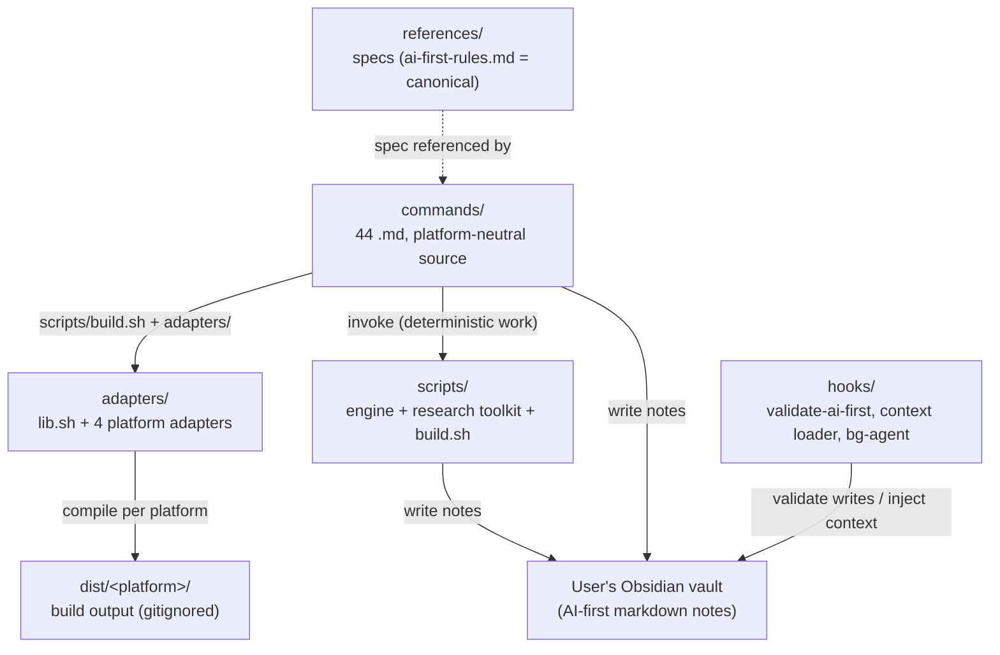

# obsidian-second-brain - architecture

How the layers fit together. This document describes the system: its components, how they connect, and how data flows from a slash command to a vault note. For the per-command operating manual see `SKILL.md`; for the contributor rules see `CLAUDE.md`.

Last reviewed against commit `ff0319c` (2026-06-05).

---

## System overview

obsidian-second-brain is a cross-CLI **skill** (not a plugin, not a hosted service) that turns any Obsidian vault into an AI-first second brain. One platform-neutral command source compiles to four AI CLIs - Claude Code, Codex CLI, Gemini CLI, OpenCode - through a build-time adapter pattern. At runtime a slash command reads and writes the user's vault as plain markdown; commands shell out to Python helpers for anything deterministic (vault health, research fetches, codebase scans).

- **44 commands**, grouped by `category:` frontmatter: vault 17, thinking 13, research 8, meta 6.
- **40 commands are cross-platform.** The 4 Google Calendar commands (`/obsidian-agenda`, `/obsidian-calendar`, `/obsidian-meeting`, `/obsidian-schedule`) carry `exclude: [codex-cli, gemini-cli, opencode]` and ship Claude Code only, because they depend on the Google Calendar MCP.
- A research toolkit that is key-less by default (free public sources) and uses Grok + Perplexity + Gemini when keys are present.
- An opt-in background agent plus optional user-scheduled agents.
- MIT licensed.

The AI-first vault rule ties it all together: every note a command writes is designed for future-Claude retrieval, not human reading. The canonical spec is `references/ai-first-rules.md`, referenced from `_CLAUDE.md` Section 0 and from every command that writes to the vault.

---

## The adapter pattern (the core idea)

`commands/` is the single source of truth. The build compiles it per platform instead of maintaining four command sets.

- `commands/<name>.md` uses Claude Code's slash-command shape and declares `description:`, `category:`, `triggers_en:`, and optional `exclude:` frontmatter.
- `scripts/build.sh` orchestrates the `adapters/` layer. `bash scripts/build.sh` builds all platforms; `--platform <name>` builds one.
- The **Claude Code adapter is an identity copy**. The other three adapters emit a dispatcher file at the dist root (`AGENTS.md` or `GEMINI.md`) with an auto-generated routing table built from each command's `description:`, grouped by `category:` then language, plus the command bodies under `.codex/commands/` (or `.gemini/`, `.opencode/`).
- Claude-specific wording is neutralized for the other CLIs (for example `Read tool` becomes `read files`).
- Output lands in `dist/<platform>/`, which is gitignored and regenerated - never hand-edited.

**Consequence for contributors:** to add or change a command, edit only `commands/<name>.md`. The adapters pick it up on the next build. No adapter change is needed.

---

## Repo layout

| Path | Role |
|---|---|
| `commands/` | 44 slash-command definitions, one `.md` each. The platform-neutral source and the product surface. |
| `references/` | Shared specs the commands link to. `ai-first-rules.md` is the canonical, non-negotiable vault-write spec. |
| `scripts/` | Python and Shell engine: build orchestrator, vault tooling, research toolkit, codebase scanner. |
| `adapters/` | Platform translation layer. `lib.sh` plus one `adapter.sh` per CLI. |
| `hooks/` | Claude Code hooks: AI-first write validation, session-start context injection, opt-in background agent. |
| `dist/` | Build output, one tree per platform. Gitignored. Regenerate with `scripts/build.sh`. |
| `tests/` | Smoke tests and fixtures, run in CI. |
| `examples/sample-vault/` | Fictional AI-first notes that show what good output looks like. |
| `SKILL.md` | Full operating manual loaded when the skill activates. |
| `architecture.md` | This document. |
| `README.md` | Public-facing docs on github.com. |
| `pyproject.toml` | Python dependencies, managed via `uv`. |

```
obsidian-second-brain/
|-- commands/            # 44 command .md files (the source)
|-- references/          # ai-first-rules.md (canonical) + schemas + templates + bases/
|-- scripts/             # build.sh, lib.sh, vault tooling, research/, architect_scan.py, ...
|-- adapters/            # lib.sh + {claude-code,codex-cli,gemini-cli,opencode}/adapter.sh
|-- hooks/               # validate-ai-first.sh, load_vault_context.py, obsidian-bg-agent.sh
|-- dist/                # build output per platform (gitignored)
|-- tests/               # smoke tests + CI fixtures
|-- examples/sample-vault/
|-- SKILL.md  architecture.md  README.md  pyproject.toml
```

---

## Architecture diagram



---

## Command categories

Commands are grouped by `category:` frontmatter, not by folder. Counts are at commit `ff0319c`. Commands marked `(Claude Code only)` are excluded from the Codex / Gemini / OpenCode builds.

### Vault (17)
Vault management: saving, organizing, searching, scheduling, maintaining.

`/obsidian-save` `/obsidian-daily` `/obsidian-log` `/obsidian-task` `/obsidian-person` `/obsidian-capture` `/obsidian-find` `/obsidian-recap` `/obsidian-board` `/obsidian-project` `/obsidian-projects` `/obsidian-recurring` `/obsidian-world` `/obsidian-agenda` (Claude Code only) `/obsidian-calendar` (Claude Code only) `/obsidian-meeting` (Claude Code only) `/obsidian-schedule` (Claude Code only)

### Thinking (13)
Use vault history to generate insight, challenge assumptions, surface patterns, and record decisions.

`/obsidian-challenge` `/obsidian-emerge` `/obsidian-connect` `/obsidian-graduate` `/obsidian-decide` `/obsidian-adr` `/obsidian-reconcile` `/obsidian-review` `/obsidian-synthesize` `/obsidian-learn` `/obsidian-panel` `/idea-discovery` `/vault-deep-synthesis`

### Research (8)
AI-powered research and ingestion; findings save to the vault following the AI-first rule.

`/research` `/research-deep` `/notebooklm` `/x-read` `/x-pulse` `/youtube` `/podcast` `/obsidian-ingest`

### Meta (6)
Bootstrap, audit, export, visualize, document, and extend the system itself.

`/obsidian-init` `/obsidian-health` `/obsidian-export` `/obsidian-visualize` `/obsidian-architect` `/create-command`

---

## The AI-first rule (non-negotiable)

Every command that writes to a vault must follow `references/ai-first-rules.md`. Notes are built for future-Claude retrieval:

- A `## For future Claude` preamble at the top of every note.
- Rich frontmatter: `type`, `date`, `tags`, `ai-first: true`, plus type-specific fields.
- `[[wikilinks]]` for every person, project, idea, decision, and concept referenced.
- External claims carry recency markers like `(as of 2026-04, source.com)` with the source URL inline.
- Confidence levels (`stated | high | medium | speculation`) where applicable.
- Anti-fabrication and search-completeness are hard rules: never invent facts, never claim absence without an exhaustive search, mark unknowns as `TBD`.

`ai-first-rules.md` also holds the per-type frontmatter schemas (daily, project, person, task, decision, devlog, review, research, adr, the thinking-tool types, agenda-snapshot, meeting, recurring-task, architecture-overview, architecture-module).

---

## Research toolkit

Lives under `scripts/research/`. One Python entry point per research command plus a `lib/` layer.

- **Keyed mode:** Perplexity Sonar for web research, Grok (xAI Agent Tools API, default grok-4) for X and live search, Gemini File Search for vault-grounded NotebookLM queries.
- **Free key-less mode:** when no Perplexity key is set, `/research` and `/research-deep` fall back to roughly ten free public sources (Wikipedia, HackerNews, arXiv, Reddit, Lobsters, dev.to, OpenAlex, Semantic Scholar, CrossRef, DuckDuckGo) via `scripts/research/lib/`, and Claude synthesizes the dossier. This removed the project's single biggest adoption barrier - the toolkit no longer hard-errors without a paid key.
- **Other ingest:** `/youtube` (transcript via `youtube-transcript-api`), `/podcast` (RSS via `feedparser`).

Configuration is read from the environment or `~/.config/obsidian-second-brain/.env`; `OBSIDIAN_VAULT_PATH` is required so notes save to the right vault on any machine.

Python dependencies (`pyproject.toml`, managed via `uv`): `openai`, `requests`, `python-dotenv`, `youtube-transcript-api`, `google-api-python-client`, `google-genai`, `feedparser`.

---

## Hooks (Claude Code)

Hooks enforce the rules mechanically instead of relying on the model to remember them. They are Claude Code specific - the other CLIs have no hook system, so there the AI-first rule rests on the in-body command instructions.

- **`validate-ai-first.sh`** (`PostToolUse` on Write/Edit). Warns when a vault markdown write is missing AI-first frontmatter or the `## For future Claude` preamble. Check 5 is the substitution-character gate (em-dash, curly quotes, Unicode math).
- **`load_vault_context.py`** (`SessionStart`). Injects `_CLAUDE.md` / `index.md` / recent log once per session so commands do not re-read the operating manual every turn.
- **`obsidian-bg-agent.sh`** (`PostCompact`, opt-in). On context compaction it spawns a headless `claude -p` in the vault to propagate the session summary into notes. Ships inert; arms only with `OBSIDIAN_BG_AGENT_ENABLED=1`. It only adds or updates - never deletes, archives, or merges.

---

## Scheduled agents

Scheduled maintenance is a usage pattern, not a set of bundled cron files. The skill does not ship `.plist` or crontab artifacts; instead the user tells Claude which commands to run on what cadence and Claude Code's scheduling system runs them autonomously. Typical uses: a morning daily-note + overdue-task pull, a nightly end-of-day summary, a weekly review, a periodic `/obsidian-health` audit.

Headless gotcha (documented in `SKILL.md`): custom slash commands do not expand in non-interactive mode. A cron or launchd job must point at the underlying command logic or a wrapper rather than relying on slash-command expansion, and launchd jobs must set an explicit `PATH` because launchd strips the environment.

---

## Runtime data flow (a command run, end to end)

```
User runs /obsidian-save (or any command)
        |
        v
Command body (from dist/<platform>/, compiled from commands/)
        |
        |-- references references/ai-first-rules.md (how to write)
        |-- invokes scripts/* for deterministic work (scan, fetch, health, build)
        v
Writes AI-first markdown notes to the vault
        |
        |-- validate-ai-first.sh checks the write (Claude Code)
        |-- propagation: updates index.md, the operation log, linked notes, daily note
        v
Vault is updated; future /obsidian-world and load_vault_context.py read that state back
```

Background path: on context compaction the opt-in PostCompact hook runs a headless `claude -p` that propagates the session summary into the vault silently.

---

## Key design principles

1. **One source, many platforms.** `commands/` is canonical; adapters compile, never fork.
2. **AI-first or it does not ship.** `ai-first-rules.md` is non-negotiable and enforced at write time.
3. **Deterministic work goes to scripts.** Commands describe intent; Python does the parsing, fetching, and scanning, then hands structured output back for synthesis.
4. **Search before create.** Never create a duplicate; never claim absence from memory.
5. **Propagate everything.** Every write updates linked notes, the index, and the operation log.
6. **Safe by default.** The background agent is opt-in and additive-only; `dist/` is regenerated, not edited; refresh-style commands (`/obsidian-architect`) use sentinel markers so re-runs never clobber hand edits.
7. **The vault compounds.** More writing means more context, which makes the AI a more capable partner over time.
